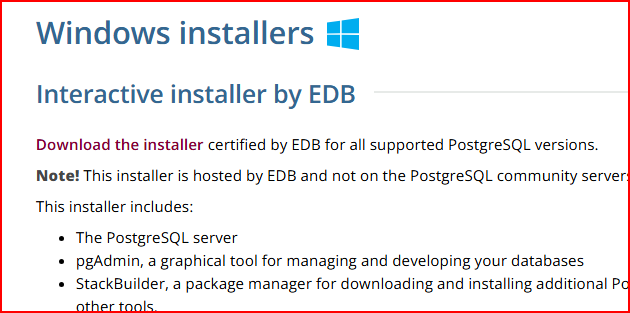
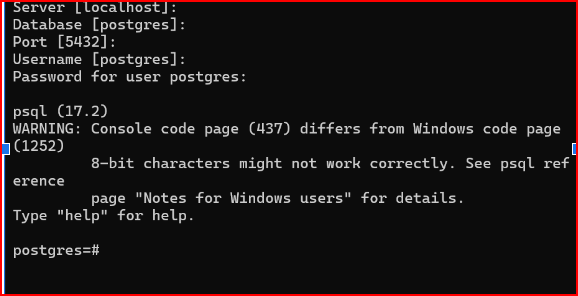
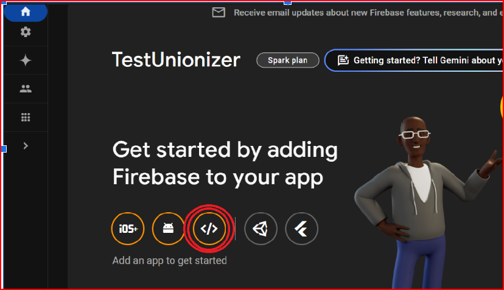

# Unionizer 
## Getting Started
**Prerequisites**
- git
- Node.js & npm
- Python3.11
- postgresSQL
- Any code editor

This project is split up into 3 folders, `client`, `server`, and `encrypt`
- `server` is the backend 
- `client` is the Next.js frontend 
- `encrypt` is a python created library for chat encryption 

# Getting started
Clone this [repo](https://github.com/xiaogavin-dev/Workplace-Unionizer/tree/main) 
```bash
git clone https://github.com/xiaogavin-dev/Workplace-Unionizer.git
```
# **Backend (Node.js)**

This is the backend service called by our client to create and access all tables and rows. This is one of the repositories that must be run for the app to function properly.

---

## **How to Run**

### **Prerequisites**
1. **Node.js Installed**: Ensure you have Node.js installed, and `npm` commands are runnable in your terminal.
2. **Code Editor**: Visual Studio Code is recommended, but any editor will work.

---

## **Setup Instructions**

### 1. Clone the Repository
- Open a terminal and ensure you are in the correct directory where you want to clone the repository.
- Navigate to the `server` folder.

### 2. Set Up Firebase Authentication
#### 2.1 Create a Firebase Project
1. Go to [Firebase Console](https://firebase.google.com/).
2. Click **Go to Console** > **Create a Project**.
3. Follow the instructions and use the default settings.

#### 2.2 Enable User Authentication
1. In the Firebase Console, under the **Build** section, click on **Authentication**.
2. Click **Get Started**.
3. Under the **Sign-in Method** tab:
   - Click on **Email/Password**.
   - Enable **Email/Password** (leave the email link disabled).
   - Click **Save**.

#### 2.3 Set Up Firebase SDK for the Server Folder
1. In the Firebase Console, click the gear icon next to **Project Overview** in the sidebar, then click **Project Settings**.
2. Navigate to the **Service Accounts** tab.
3. Scroll down and click **Generate new private key**.
   - You will see a warning reminding you to keep the private key **PRIVATE** (ensure the key is added to `.gitignore` if it’s not already there).
   - Click **Generate Key**.
4. **Add the Service Account Key to Your Project**:
   1. Locate the downloaded key in your local `Downloads` directory.
   2. Move the file or copy its contents into the cloned repository folder.
   3. Rename the file to `serviceAccountKey.json`.
   4. Ensure it looks like this:

   

   5. After renaming, it should look like this:

   

---

### 3. Install Dependencies
After setting up Firebase, navigate to the cloned repository folder and run:
```bash
npm i
```
This will install all the packages and dependencies required for the project.

---

### 4. Set Up the Database
#### 4.1 Install PostgreSQL
- If you already have PostgreSQL installed, skip this step.
- Go to [PostgreSQL Downloads](https://www.postgresql.org/download/) and download PostgreSQL for your operating system.
- **For Windows**:
  1. Click on **Windows** and then **Download the Installer**.
  2. 
  3. Download the latest version for your specific device architecture (e.g., Windows x-86-64).
  4. Follow the installation process.
- After installation, open **SQL Shell** and set it up as per your requirements.
    1. follow the instructions on this link until the terminal looks like this
    2. 
    3. we will add the information you just set up into a .env file in the next step

#### 4.2 Set Up Environment Variables
- Create a file called `.env` in the root of your project.
- Add the following structure to the `.env` file (use your PostgreSQL credentials):
  ```bash
  DB_USERNAME=postgres
  DB_PASSWORD=(your_password)
  DB_NAME=postgres
  DB_HOST=localhost
  DB_PORT=5432
  ```

---

### **Next Steps**
- Run database migrations: 
  ```bash
  npx sequelize-cli db:migrate
  ```
- Start the backend server:
  - Using Node.js:
    ```bash
    node index.js
    ```
  - Using Nodemon (if installed):
    ```bash
    nodemon index.js
    ```

---


## Client
1. Install all modules needed for the client
```bash
npm install
```
2. After all modules have been installed, create a file named `.env.local`
```bash
touch .env.local
```
3. You will need to access the Firebase account created earlier when setting up the server. 

- Go to [Google Firebase](https://firebase.google.com/)  
- Click on 'Go to Console' in the upper right corner
- Click on the project creted earlier
- On the dashboard, click on the web app circle to create a webapp, you can enter any app name for this and register this app.
- 
- you can find the information while you register or you can find it again if you click on "project overview" and click on your webapp settings.
- You will use the information in your env file which is set up in the following step.
4. Create an .env.local file. Edit with your chosen editor, we use gedit here but any text editor works. Replace with what you have on Firebase and save 
```bash
gedit .env.local
```
```
NEXT_PUBLIC_FIREBASE_API_KEY=**apiKey**
NEXT_PUBLIC_FIREBASE_AUTH_DOMAIN=**authDomain**
NEXT_PUBLIC_FIREBASE_PROJECT_ID=**projectId**
NEXT_PUBLIC_FIREBASE_STORAGE_BUCKET=**storageBucket**
NEXT_PUBLIC_FIREBASE_MESSAGING_SENDER_ID=**messagingSenderId**
NEXT_PUBLIC_FIREBASE_APP_ID=**appId**
NEXT_PUBLIC_FIREBASE_MEASUREMENT_ID=**measurementId**
NEXT_PUBLIC_ENCRYPTION_PORT=http://34.207.155.52:5000
NEXT_PUBLIC_BACKEND_PORT=5000
```
5. Starting up frontend of the app
```bash
npm run dev
```
6. View the app in your browser at 
[http://localhost:3000/](http://localhost:3000/)

## Encrypt
**This doesn't need to be hosted locally**
This service has already been hosted and can be accessed using the public ip which is already in the env.local file in the client folder.

The encryption service is what we call in order to properly create, encrypt, and decrypt keys and messages. We chose to combine an asymmetric and symmetric approach when it comes to encrypting messages to make sure no content is exposed inside the database. 

To quickly touch on how messages are encrypted, when a user signs up for an account, an RSA public and private key is created. The public key can be shared with everyone so it is stored in the database. The private key on the other hand MUST be kept hidden, thus we keep it in client side storage using indexedDB. 

Each group chat has a certain number of people. Each person has their own public key. Each chat will have a symmetric key, which will be used to encrypt and decrypt the messages. This one symmetric key will be used by everyone that has access to the group chat. However this symmetric key cannot be stored in the database as it is, otherwise anyone with access to the database would be able to decrypt the messages. 

This is why we created the public and private keys, in order to securely share the symmetric key. When some data, in our case the symmetric key, is encrypted using someone’s public key, it can ONLY be decrypted using that person's private key. This is how we will securely store and share the symmetric key. 

When a group chat is created, the symmetric key for that group chat will be encrypted by everyone’s public key. If someone needs access to the symmetric key (for example, when someone needs to decrypt or encrypt a message), they will grab the encrypted symmetric key that is associated with their public key. The user will then decrypt the encrypted symmetric key using their private key, which is stored on the user's device. Now that it is decrypted it can be used to further encrypt and decrypt a message.

How do we handle when someone new joins a group chat? To handle this, we made it so there are key versions. Each message will have a certain key version which represents the symmetric key used to encrypt that message. When a new user joins, it triggers the creation of a new key version which will now be used to encrypt and decrypt future messages. The old key is still kept in storage, so that old users will still be able to decrypt the previous messages.
 
The symmetric key is used in an encryption method called AES, which is a fast and reliable way to encrypt data. 

All the calls to create keys, encrypt, or decrypt messages are done through this flask api we created. The encryption service is currently being hosted and you do not need to set this portion up as long as you enter the following public ip on your frontend .env.local file : 34.207.155.52

