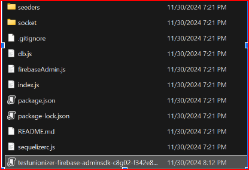
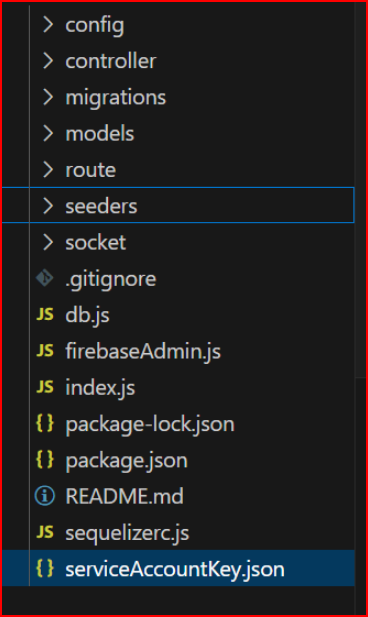

# **Backend (Node.js)**

This is the backend service called by our client to create and access all tables and rows. This is one of the repositories that must be run for the app to function properly.

---

## **How to Run**

### **Prerequisites**
1. **Node.js Installed**: Ensure you have Node.js installed, and `npm` commands are runnable in your terminal.
2. **Code Editor**: Visual Studio Code is recommended, but any editor will work.

---

## **Setup Instructions**

### 1. Clone the Repository
- Open a terminal and ensure you are in the correct directory where you want to clone the repository.
- Navigate to the `server` folder.

### 2. Set Up Firebase Authentication
#### 2.1 Create a Firebase Project
1. Go to [Firebase Console](https://firebase.google.com/).
2. Click **Go to Console** > **Create a Project**.
3. Follow the instructions and use the default settings.

#### 2.2 Enable User Authentication
1. In the Firebase Console, under the **Build** section, click on **Authentication**.
2. Click **Get Started**.
3. Under the **Sign-in Method** tab:
   - Click on **Email/Password**.
   - Enable **Email/Password** (leave the email link disabled).
   - Click **Save**.

#### 2.3 Set Up Firebase SDK for the Server Folder
1. In the Firebase Console, click the gear icon next to **Project Overview** in the sidebar, then click **Project Settings**.
2. Navigate to the **Service Accounts** tab.
3. Scroll down and click **Generate new private key**.
   - You will see a warning reminding you to keep the private key **PRIVATE** (ensure the key is added to `.gitignore` if it’s not already there).
   - Click **Generate Key**.
4. **Add the Service Account Key to Your Project**:
   1. Locate the downloaded key in your local `Downloads` directory.
   2. Move the file or copy its contents into the cloned repository folder.
   3. Rename the file to `serviceAccountKey.json`.
   4. Ensure it looks like this:

   

   5. After renaming, it should look like this:

   

---

### 3. Install Dependencies
After setting up Firebase, navigate to the cloned repository folder and run:
```bash
npm i
```
This will install all the packages and dependencies required for the project.

---

### 4. Set Up the Database
#### 4.1 Install PostgreSQL
- If you already have PostgreSQL installed, skip this step.
- Go to [PostgreSQL Downloads](https://www.postgresql.org/download/) and download PostgreSQL for your operating system.
- **For Windows**:
  1. Click on **Windows** and then **Download the Installer**.
  2. 
  3. Download the latest version for your specific device architecture (e.g., Windows x-86-64).
  4. Follow the installation process.
- After installation, open **SQL Shell** and set it up as per your requirements.

#### 4.2 Set Up Environment Variables
- Create a file called `.env` in the root of your project.
- Add the following structure to the `.env` file (use your PostgreSQL credentials):
  ```bash
  DB_USERNAME=postgres
  DB_PASSWORD=(your_password)
  DB_NAME=postgres
  DB_HOST=localhost
  DB_PORT=5432
  ```

---

### **Next Steps**
- Run database migrations: 
  ```bash
  npx sequelize-cli db:migrate
  ```
- Start the backend server:
  - Using Node.js:
    ```bash
    node index.js
    ```
  - Using Nodemon (if installed):
    ```bash
    nodemon index.js
    ```

---


